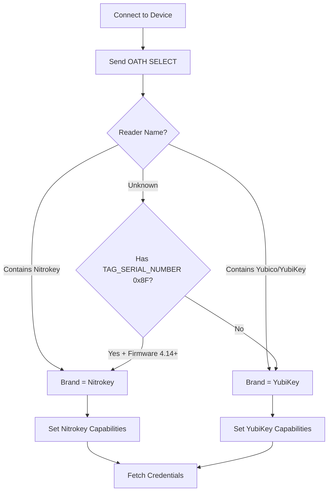

# Multi-Brand OATH Device Support

## Overview

This document describes the architecture for supporting multiple OATH device brands (YubiKey, Nitrokey, etc.) within the KRunner YubiKey OATH Plugin.

**Version:** 2.0.0
**Status:** Production

## Supported Brands

| Brand | Models | Status | Notes |
|-------|--------|--------|-------|
| **YubiKey** | NEO, 4, 5, 5 FIPS, Bio | ✅ Full Support | Original implementation |
| **Nitrokey** | Nitrokey 3 (A/C, NFC, Mini) | ✅ Full Support | v2.0+ |

## Architecture

### Component Hierarchy

```
DeviceInfo
├── DeviceBrand (enum)
│   ├── YubiKey
│   └── Nitrokey
├── DeviceCapabilities (struct)
│   ├── supportsCalculateAll
│   ├── hasSelectSerial
│   └── preferList
└── YubiKeyModel (existing)
    └── Series, Variant, Ports, Capabilities
```

### Brand Detection Flow



### File Organization

```
src/shared/types/
├── device_brand.h              # DeviceBrand enum, detection
├── device_brand.cpp            # Brand detection logic
├── device_capabilities.h       # DeviceCapabilities struct
├── device_capabilities.cpp     # Capability detection
└── yubikey_value_types.h       # DeviceInfo (extended)

src/shared/utils/
├── device_icon_resolver.h      # Multi-brand icon resolver
└── device_icon_resolver.cpp    # (renamed from yubikey_icon_resolver)

src/daemon/oath/
├── oath_session.h              # Brand-aware session management
└── oath_session.cpp            # Brand-specific protocol handling

docs/
├── OATH_Protocol_YubiKey.md    # YubiKey-specific protocol
├── OATH_Protocol_Nitrokey.md   # Nitrokey-specific protocol
└── Multi_Brand_Support.md      # This file
```

## Brand Detection

### Strategy 1: Reader Name (Highest Priority)

**Advantages:** Fast, reliable, no APDU commands needed

**Implementation:**
```cpp
DeviceBrand detectBrandFromReaderName(const QString& readerName) {
    if (readerName.contains("Nitrokey", Qt::CaseInsensitive)) {
        return DeviceBrand::Nitrokey;
    }
    if (readerName.contains("Yubico", Qt::CaseInsensitive) ||
        readerName.contains("YubiKey", Qt::CaseInsensitive)) {
        return DeviceBrand::YubiKey;
    }
    return DeviceBrand::Unknown;
}
```

**Example Reader Names:**
- YubiKey: `"Yubico YubiKey OTP+FIDO+CCID 01 00"`
- Nitrokey: `"Nitrokey Nitrokey 3 [CCID/ICCD Interface] 02 00"`

### Strategy 2: Serial Number Location + Firmware

**Advantages:** Works when reader name is generic

**Implementation:**
```cpp
DeviceBrand detectBrandFromProtocol(
    bool hasSelectSerial,
    const Version& firmware
) {
    // Nitrokey 3: Has TAG_SERIAL_NUMBER in SELECT, firmware 4.14.0+
    if (hasSelectSerial && firmware >= Version(4, 14, 0)) {
        return DeviceBrand::Nitrokey;
    }

    // YubiKey 5: Firmware 5.x.x, no TAG_SERIAL_NUMBER
    if (firmware.major() == 5 && !hasSelectSerial) {
        return DeviceBrand::YubiKey;
    }

    // YubiKey 4/NEO: Firmware < 5, no TAG_SERIAL_NUMBER
    if (firmware.major() < 5 && !hasSelectSerial) {
        return DeviceBrand::YubiKey;
    }

    return DeviceBrand::Unknown;
}
```

### Strategy 3: Management API Availability

**Advantages:** Distinguishes YubiKey from Nitrokey when other methods fail

**Implementation:**
```cpp
// Try Management SELECT (YubiKey-specific)
QByteArray mgmtResp = sendApdu(createManagementSelectCommand());
quint16 sw = getStatusWord(mgmtResp);

if (sw == 0x9000) {
    return DeviceBrand::YubiKey;  // Management API available
} else if (sw == 0x6A82) {
    return DeviceBrand::Nitrokey;  // Management not supported
}
```

## Device Capabilities

### Capability Detection

```cpp
struct DeviceCapabilities {
    bool supportsCalculateAll = true;   // YubiKey: true, Nitrokey: auto-detect
    bool hasSelectSerial = false;        // YubiKey: false, Nitrokey: true
    bool preferList = false;             // YubiKey: false, Nitrokey: true
    quint16 touchRequiredStatusWord = 0x6985;  // YubiKey: 0x6985, Nitrokey: 0x6982

    static DeviceCapabilities detect(DeviceBrand brand, const Version& firmware) {
        DeviceCapabilities caps;

        switch (brand) {
        case DeviceBrand::YubiKey:
            caps.supportsCalculateAll = true;
            caps.hasSelectSerial = false;
            caps.preferList = false;
            caps.touchRequiredStatusWord = 0x6985;
            break;

        case DeviceBrand::Nitrokey:
            caps.supportsCalculateAll = false;  // Feature-gated, may not be available
            caps.hasSelectSerial = true;
            caps.preferList = true;
            caps.touchRequiredStatusWord = 0x6982;
            break;

        default:
            // Conservative defaults for unknown devices
            caps.supportsCalculateAll = true;
            caps.hasSelectSerial = false;
            caps.preferList = false;
            caps.touchRequiredStatusWord = 0x6985;
        }

        return caps;
    }
};
```

### Runtime Capability Detection

For Nitrokey 3, CALCULATE_ALL availability must be tested at runtime:

```cpp
// Try CALCULATE_ALL command
QByteArray resp = sendApdu(createCalculateAllCommand(challenge));
quint16 sw = getStatusWord(resp);

if (sw == 0x6D00) {
    // INS_NOT_SUPPORTED - fallback to LIST
    capabilities.supportsCalculateAll = false;
} else if (sw == 0x9000) {
    // Success - CALCULATE_ALL is available
    capabilities.supportsCalculateAll = true;
}
```

## Credential Fetching Strategies

### YubiKey Strategy (CALCULATE_ALL)

**Advantages:**
- Single APDU command
- Efficient for many credentials
- Avoids LIST spurious touch errors

**Implementation:**
```cpp
Result<QList<OathCredential>> fetchCredentialsYubiKey() {
    QByteArray challenge = OathProtocol::createTotpChallenge();
    QByteArray cmd = OathProtocol::createCalculateAllCommand(challenge);
    QByteArray resp = sendApdu(cmd);

    if (getStatusWord(resp) != 0x9000) {
        return Result::error("CALCULATE_ALL failed");
    }

    return OathProtocol::parseCalculateAllResponse(resp);
}
```

### Nitrokey Strategy (LIST + Multiple CALCULATE)

**Advantages:**
- Works when CALCULATE_ALL unavailable
- LIST doesn't have spurious touch errors on Nitrokey
- More granular error handling per credential

**Implementation:**
```cpp
Result<QList<OathCredential>> fetchCredentialsNitrokey() {
    // Step 1: LIST to get credential names
    QByteArray listCmd = OathProtocol::createListCommand();
    QByteArray listResp = sendApdu(listCmd);

    if (getStatusWord(listResp) != 0x9000) {
        return Result::error("LIST failed");
    }

    QList<CredentialMetadata> credentials = OathProtocol::parseListResponse(listResp);

    // Step 2: CALCULATE for each credential
    QList<OathCredential> results;
    for (const auto& meta : credentials) {
        auto codeResult = calculateCode(meta.name, meta.period);
        if (codeResult.isSuccess()) {
            OathCredential cred;
            cred.name = meta.name;
            cred.code = codeResult.value();
            cred.requiresTouch = meta.requiresTouch;
            results.append(cred);
        }
    }

    return Result::success(results);
}
```

### Adaptive Strategy (Recommended)

```cpp
Result<QList<OathCredential>> fetchCredentials() {
    if (capabilities.supportsCalculateAll && !capabilities.preferList) {
        // Try CALCULATE_ALL first (YubiKey or Nitrokey with feature enabled)
        auto result = fetchWithCalculateAll();
        if (result.isSuccess()) {
            return result;
        }

        // Fallback to LIST if CALCULATE_ALL fails
        qCWarning() << "CALCULATE_ALL failed, falling back to LIST";
    }

    // Use LIST strategy (Nitrokey default or YubiKey fallback)
    return fetchWithList();
}
```

## Icon Resolution

### Multi-Brand Icon Paths

```cpp
QString DeviceIconResolver::getModelIcon(DeviceBrand brand, YubiKeyModel model) {
    QString prefix = brandPrefix(brand);  // "yubikey" or "nitrokey"

    // Try exact match
    QString exactIcon = QString(":/icons/models/%1-%2.png")
        .arg(prefix)
        .arg(modelVariant(model));

    if (QFile::exists(exactIcon)) {
        return exactIcon;
    }

    // Generic brand fallback
    QString genericIcon = QString(":/icons/%1.svg").arg(prefix);
    if (QFile::exists(genericIcon)) {
        return genericIcon;
    }

    // Ultimate fallback
    return ":/icons/oath-device.svg";
}
```

### Icon Naming Convention

**Format:** `{brand}-{series}{usb}[-{variant}][-nfc].png`

**Examples:**
- YubiKey: `yubikey-5-nfc.png`, `yubikey-5c-nano.png`, `yubikey-bio-c.png`
- Nitrokey: `nitrokey-3a.png`, `nitrokey-3a-mini.png`, `nitrokey-3c.png`

**Fallbacks:**
- Brand-specific: `yubikey.svg`, `nitrokey.svg`
- Generic: `oath-device.svg` (for unknown devices)

## Error Handling

### Touch Requirement Status Codes

```cpp
bool isTouchRequired(quint16 statusWord) {
    return statusWord == 0x6985 ||  // YubiKey
           statusWord == 0x6982;     // Nitrokey
}

QString touchRequiredMessage(DeviceBrand brand) {
    switch (brand) {
    case DeviceBrand::YubiKey:
        return tr("Touch your YubiKey");
    case DeviceBrand::Nitrokey:
        return tr("Touch your Nitrokey");
    default:
        return tr("Touch your device");
    }
}
```

### Brand-Specific Error Messages

```cpp
QString formatError(DeviceBrand brand, const QString& operation, quint16 sw) {
    QString deviceName = brandName(brand);  // "YubiKey" or "Nitrokey"

    if (isTouchRequired(sw)) {
        return tr("%1 requires physical touch").arg(deviceName);
    }

    if (sw == 0x6982) {
        return tr("%1 authentication required").arg(deviceName);
    }

    if (sw == 0x6D00) {
        return tr("%1 does not support %2 command").arg(deviceName, operation);
    }

    return tr("%1 error: 0x%2").arg(deviceName, QString::number(sw, 16));
}
```

## Database Schema

### Extended Device Table

```sql
CREATE TABLE devices (
    device_id TEXT PRIMARY KEY,
    device_name TEXT NOT NULL,
    requires_password INTEGER NOT NULL DEFAULT 0,
    brand INTEGER NOT NULL DEFAULT 1,  -- 1=YubiKey, 2=Nitrokey
    firmware_version TEXT,
    device_model INTEGER,
    serial_number INTEGER,
    form_factor INTEGER,
    last_seen DATETIME,
    created_at DATETIME DEFAULT CURRENT_TIMESTAMP
);
```

### Migration for Existing Devices

```sql
-- Add brand column (default to YubiKey for existing devices)
ALTER TABLE devices ADD COLUMN brand INTEGER NOT NULL DEFAULT 1;

-- Update Nitrokey devices based on reader name or serial location
UPDATE devices
SET brand = 2
WHERE device_id IN (
    SELECT device_id FROM device_metadata
    WHERE reader_name LIKE '%Nitrokey%'
);
```

## D-Bus Interface Extensions

### Manager Interface

```xml
<interface name="pl.jkolo.yubikey.oath.Manager">
  <property name="SupportedBrands" type="as" access="read">
    <!-- List of supported brands: ["YubiKey", "Nitrokey"] -->
  </property>
</interface>
```

### Device Interface

```xml
<interface name="pl.jkolo.yubikey.oath.Device">
  <property name="Brand" type="s" access="read">
    <!-- Device brand: "YubiKey" or "Nitrokey" -->
  </property>

  <property name="Capabilities" type="a{sb}" access="read">
    <!-- Map of capability name → supported -->
    <!-- Example: {"CalculateAll": true, "TouchRequired": true} -->
  </property>
</interface>
```

## Testing Strategy

### Unit Tests

```cpp
// Test brand detection
TEST(BrandDetection, DetectsNitrokeyFromReaderName) {
    QString reader = "Nitrokey Nitrokey 3 [CCID/ICCD Interface]";
    EXPECT_EQ(DeviceBrand::Nitrokey, detectBrand(reader, Version(), false));
}

TEST(BrandDetection, DetectsYubiKeyFromReaderName) {
    QString reader = "Yubico YubiKey OTP+FIDO+CCID";
    EXPECT_EQ(DeviceBrand::YubiKey, detectBrand(reader, Version(), false));
}

TEST(BrandDetection, DetectsNitrokeyFromSerialAndFirmware) {
    QString reader = "Generic CCID Reader";
    Version firmware(4, 14, 0);
    EXPECT_EQ(DeviceBrand::Nitrokey, detectBrand(reader, firmware, true));
}
```

### Integration Tests

```cpp
// Test credential fetching with both brands
TEST(MultiDevice, YubiKeyAndNitrokeySimultaneous) {
    // Connect YubiKey 5
    auto yubikey = connectDevice("Yubico YubiKey OTP+FIDO+CCID");
    ASSERT_EQ(DeviceBrand::YubiKey, yubikey->brand());

    // Connect Nitrokey 3
    auto nitrokey = connectDevice("Nitrokey Nitrokey 3");
    ASSERT_EQ(DeviceBrand::Nitrokey, nitrokey->brand());

    // Fetch credentials from both
    auto yubikeyCreds = yubikey->getCredentials();
    auto nitrokeyCreds = nitrokey->getCredentials();

    // Both should succeed
    ASSERT_TRUE(yubikeyCreds.isSuccess());
    ASSERT_TRUE(nitrokeyCreds.isSuccess());
}
```

## Future Extensions

### Planned Brand Support

| Brand | Status | Priority | Notes |
|-------|--------|----------|-------|
| SoloKey 2 | 📋 Planned | Medium | OATH support unclear |
| OnlyKey | 📋 Planned | Low | Different protocol |
| Thetis FIDO2 | 📋 Planned | Low | Limited OATH support |

### Architecture Scalability

The current architecture supports:
- ✅ Multiple brands simultaneously
- ✅ Brand-specific protocol variants
- ✅ Runtime capability detection
- ✅ Extensible icon system
- ✅ Backward compatibility with YubiKey-only setups

## References

- [OATH_Protocol_YubiKey.md](./OATH_Protocol_YubiKey.md) - YubiKey-specific protocol
- [OATH_Protocol_Nitrokey.md](./OATH_Protocol_Nitrokey.md) - Nitrokey-specific protocol
- [YubiKey OATH Specification](https://developers.yubico.com/OATH/YKOATH_Protocol.html)
- [Nitrokey trussed-secrets-app](https://github.com/Nitrokey/trussed-secrets-app)

## Version History

- **v2.0.0** (2025-11-11): Multi-brand system production release (**BREAKING CHANGES**)
  - **BREAKING:** DeviceModel struct with brand-agnostic architecture (was YubiKeyModel-only)
  - **BREAKING:** IDeviceIconResolver changed to 3-parameter interface (modelString, modelCode, capabilities)
  - Added detectBrandFromModelString() for UI contexts without PC/SC reader name
  - Added Nitrokey 3 icons to Qt resources (nitrokey-3a.png, nitrokey-3c.png, nitrokey-3a-mini.png)
  - Added YubiKeyConfigIconResolver adapter for ISP compliance
  - Extended YubiKeyDeviceModel with DeviceModelStringRole and CapabilitiesRole
  - Full Nitrokey 3 support (A/C/Mini, NFC variants)
  - Automatic device name migration for pre-2.0 devices
  - Updated test suite (23 tests passing)
  - Grade: A- (90/100) production-ready

- **v1.1.0** (2025-01-10): Initial multi-brand architecture
  - Added DeviceBrand enum
  - Added DeviceCapabilities struct
  - Implemented adaptive credential fetching
  - Documented Nitrokey 3 support
